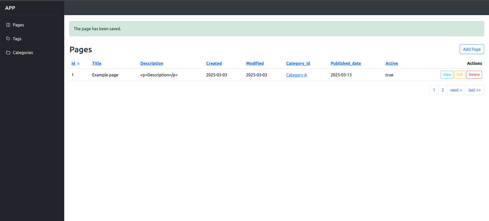
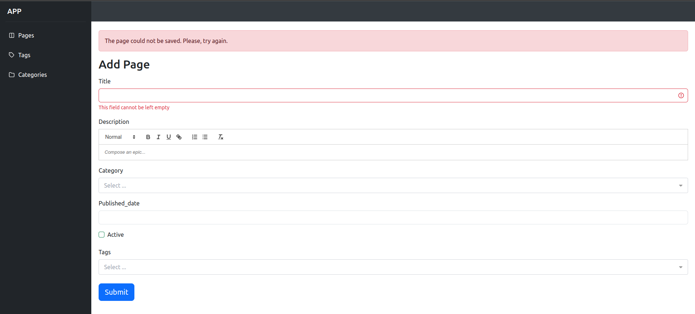
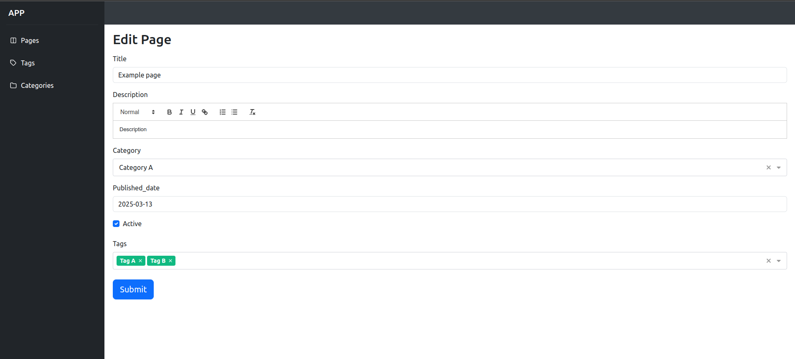
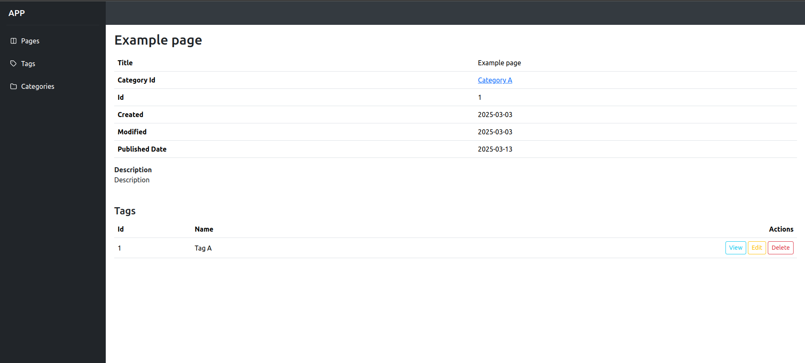
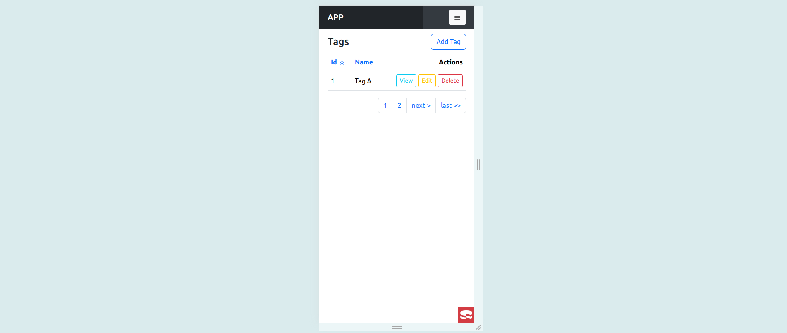
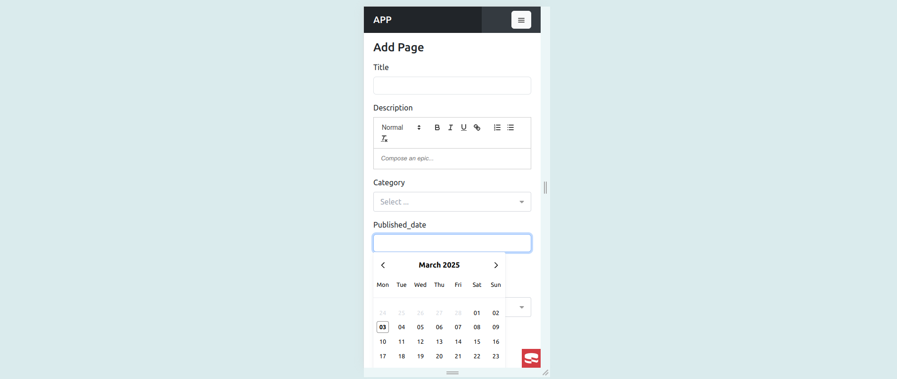
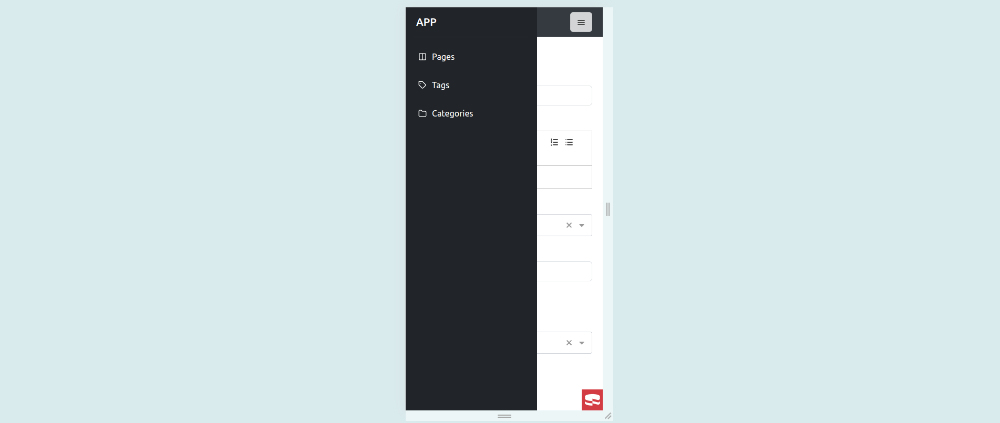
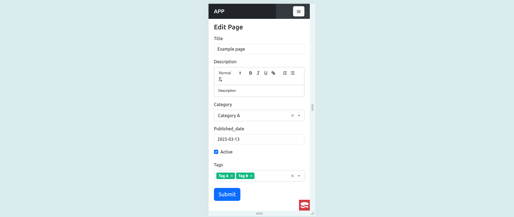

### bake CRUD system

For this example we use sql file on *config/sql/example/postgresql.pgsql*

Once the database has been created, bake models and controllers as normal using

Important: if you are using the docker example configuration with Postgres you need to change in your app.php,
the 'encoding' option inside Datasources to 'utf8' instead of 'utf8mb4',

```
bin/cake bake model Pages --theme CakeDC/Inertia
bin/cake bake controller Pages --theme CakeDC/Inertia
bin/cake bake model Tags --theme CakeDC/Inertia
bin/cake bake controller Tags --theme CakeDC/Inertia
bin/cake bake model Categories --theme CakeDC/Inertia
bin/cake bake controller Categories --theme CakeDC/Inertia
```

bake templates using **vue_template** instead of **template** as

```
bin/cake bake vue_template Pages --theme CakeDC/Inertia
bin/cake bake vue_template Tags --theme CakeDC/Inertia
bin/cake bake vue_template Categories --theme CakeDC/Inertia
```

Note: if you rewrite PagesController.php must be create the dashboard funcion on the controller

Again run

```
npm run dev
```

You see results for example going to https://inertiavitecake.ddev.site/pages/index

### Add Menu

You can add and vertical menu to navigate through controllers

Edit *resources/components/Theme/Nav.vue* and put inside span element below commet <!-- app menu -->

```
    <!-- app menu -->
    <span>
      <Link href="/pages" class="nav-link ps-4 px-2"><i data-feather="columns"></i> Pages</Link>
      <Link href="/tags" class="nav-link ps-4 px-2"><i data-feather="tag"></i> Tags</Link>
      <Link href="/categories" class="nav-link ps-4 px-2"><i data-feather="folder"></i> Categories</Link>
    </span>
```

#### Desktop version

Index



Add



Edit



View



#### Mobile version

Index



Add 



Menu



Edit




### bake CRUD system with prefix

Add route to prefix Admin on *config/routes.php*

```
$builder->prefix('admin', function (RouteBuilder $builder) {
    $builder->fallbacks(DashedRoute::class);
});
```

To generate controllers and template with a prefix use **--prefix** option of bake command as

```
bin/cake bake controller Pages --prefix Admin --theme CakeDC/Inertia
bin/cake bake controller Tags --prefix Admin --theme CakeDC/Inertia
bin/cake bake controller Categories --prefix Admin --theme CakeDC/Inertia
bin/cake bake vue_template Pages --prefix Admin --theme CakeDC/Inertia
bin/cake bake vue_template Tags --prefix Admin --theme CakeDC/Inertia
bin/cake bake vue_template Categories --prefix Admin --theme CakeDC/Inertia
```

Again run

```
npm run dev
```

You can go to https://inertiavitecake.ddev.site/admin/pages/index
