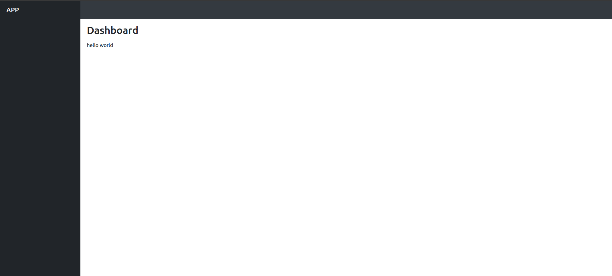

## How to Use

### Simple Navigation on Two Pages

We need to add first *InertiaResponseTrait* to the controller

```
use CakeDC\Inertia\Traits\InertiaResponseTrait;

class PagesController extends AppController
{

  use InertiaResponseTrait;

  ...
  ...

}
```

Create a two function that would look like this

```
    public function dashboard()
    {
        $this->viewBuilder()->setTheme('CakeDC/Inertia');

        $page = [
            'text' => 'hello world',
        ];
        $this->set(compact('page'));
    }
```

in *config/routes.php* uncomment lines to catch all routes

```
$builder->connect('/{controller}', ['action' => 'index']);
$builder->connect('/{controller}/{action}/*', []);
```

and comment the line

```
$builder->connect('/pages/*', 'Pages::display');
```

to load dashboard directly replace line

```
$builder->connect('/', ['controller' => 'Pages', 'action' => 'index', 'home']);
```

with

```
$builder->connect('/', ['controller' => 'Pages', 'action' => 'dashboard']);
```

For development exec Vite server on the container

```
npm run dev
```

For production exec `vite vuild` on the container

```
npm run build
```

This generates this assets directory inside webroot dir, the helper automatically load the files parsing the manifest.json

Go to https://inertiavitecake.ddev.site see Dashboard Vue Component page that prints values assigneds on dashboard CakePHP function

